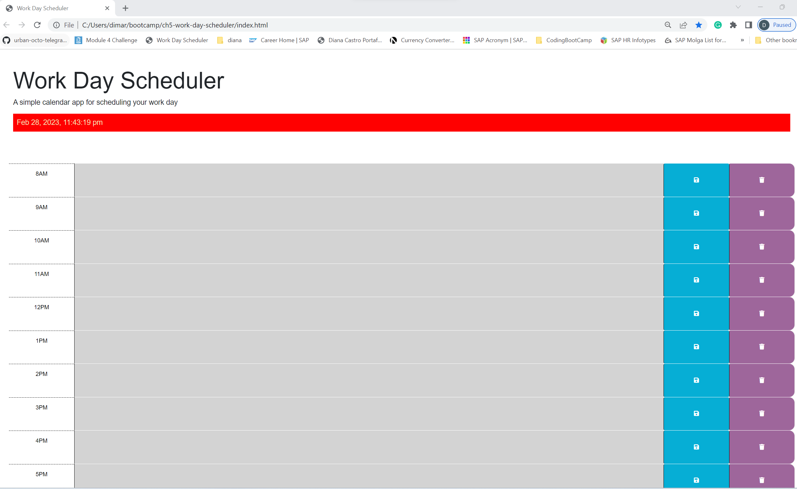
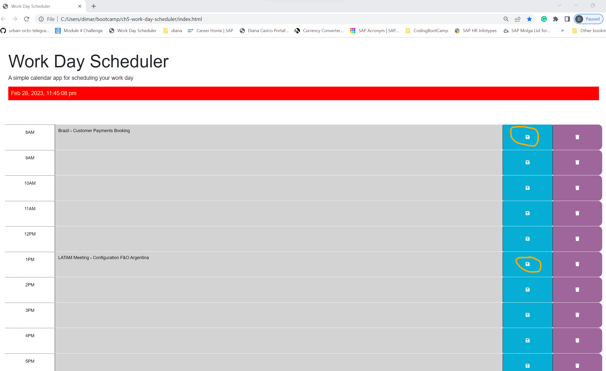
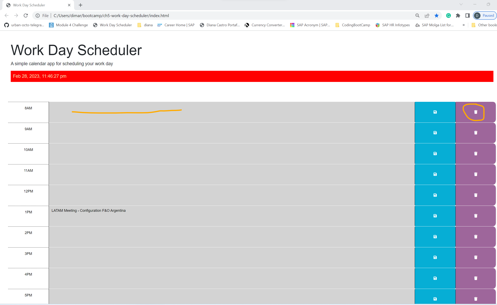

# Work Day Scheduler

## Description

The Work Day Scheduler is an app for the user to schedule work tasks for a regular 8 working hours. The user can save the tasks and see them later after restarting the page or can just delete them to start entering new tasks the next day. The current time is shown at the top of the page to keep the user on 
track of the current time and also for the user to be able to detect the passing of time by seeing the calendar text content areas changing colors from red signaling the present to grey signaling the past and green color signaling the future. The Work Day Scheduler app is coded in jquery and javascript and it is using bootstrap to stylying it.

## Table of Contents

- [Installation](#installation)
- [Usage](#usage)
- [ChallengeURL](#challengeurl)
- [Credits](#credits)
- [License](#license)

## Installation

1. Cloned the started code from https://github.com/coding-boot-camp/crispy-octo-meme.git using git bash.
2. Created a new repository in GitHub for my Work Day Scheduler challenge.
3. Cloned it to my local repository using git bash.
4. Created my html, css and javascript folders and files on my local repository and added, committed and pushed the started code from "crispy-octo-meme" to my
   remote repository.
5. Created 4 feature branches to add, commit and push my new coding and changes from my local repo to my remote repo to keep the backups safe.
6. Created the Readme File.

## Usage 

 Work Day Scheduler 11:40 pm past 5:00 pm all in gray color
 Work Day Scheduler Tasks added by clicking the save button
 Work Day Scheduler Tasks deleted by clicking the delete button

## ChallengeURL

https://dimartoro.github.io/ch5-work-day-scheduler/

## Credits

https://github.com/coding-boot-camp/crispy-octo-meme.git

https://day.js.org/docs/en/get-set/hour

https://jqueryui.com/

https://developer.mozilla.org/en-US/docs/Web/JavaScript/Reference/Statements

https://developer.mozilla.org/en-US/docs/Web/API/setTimeout

https://www.w3schools.com/jsref/event_onclick.asp

https://www.semrush.com/blog/semantic-html5-guide/

## License

Please refer to the License in the repository.